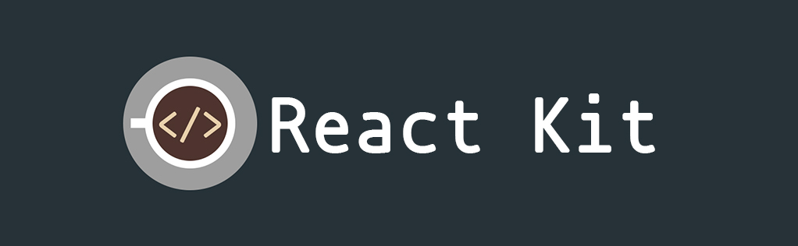

A barebones React starter kit.

#### Core Dependency Status

[![npm version][npm-img]][npm-url]
[![node version][node-img]][node-url]
[![deps][deps-img]][deps-url]

#### Repository Status

[![open issues][issues-img]][issues-url]
[![open prs][pr-img]][pr-url]
![code size][code-size-img]
[![contributors][contributor-img]][contributor-url]


# Includes
- [React](https://github.com/facebook/react)
- [Redux](https://github.com/reactjs/redux)
- [redux-saga](https://github.com/redux-saga/redux-saga)
- [React Loadable](https://github.com/jamiebuilds/react-loadable)
- [React Router](https://github.com/ReactTraining/react-router)
- [Webpack](https://github.com/webpack/webpack)
- Ducks Pattern ["Official Proposal"](https://github.com/erikras/ducks-modular-redux)
- [styled-components](https://github.com/styled-components/styled-components)
- [lint-staged](https://github.com/okonet/lint-staged) for pre-commit hooks

More here on the [convenience package](https://github.com/codesandcoffees/react-pkg)

# App Structure
```
react-kit/
  .vscode/
  build/
  config/
  public/
  scripts/
  src/
  --components/
  --containers
  --routes/
  --sagaDucks/
  --services/
  --App.js
  --index.js
  --registerServiceWorker.js
  --store.js
  package.json
  README.md
```

# Getting Started
At the time of writing this, the following versions were used
```
node -v 8.11.3
npm -v 6.2.0
```
1. Clone the repository
```
git clone git@github.com:codesandcoffees/react-kit.git
```
2. Go into the directory
```
cd react-kit
```
3. Install the packages
```
npm run install
```
# Commands
Run by `npm run <script>`
* **`start`** - Start the app. Access at [http://localhost:3000/](http://localhost:3000/)
* **`deploy`** - Will deploy a production build to the `gh-pages` branch.
* **`lint:log`** - Lint the app and save the results to `lint.log` file.
* **`lint:test`** - Lint the app and display the results in the terminal.
* **`lint:fix`** - Attempt to autofix linting issues.
* **`build-only`** - Will create a production ready build to the `build` folder.
* **`precommit`** - The precommit hook which runs lint-staged to lint staged files on commit.
* **`precommit:init`** - Install precommit related tools independently if you cannot see a precommit hook when you do a commit.
* **`mine`** - Make it yours but will not delete the core `js` files. Will only delete files related to the original repository.

# Development
To start development server and access the site at [localhost:3000/](localhost:3000/)
```
npm run start
```

And if you only want to build the files
```
npm run build-only
```

# Deployment
The deployment process in this app only supports github pages using the `gh-pages` branch. To set it up:
1. Make necessary changes to your repository's settings.

Change the `source` to `gh-pages branch`.

If you have your own domain. Input your `custom domain` if you have and don't forget to add a `CNAME` file in the `public` folder. This will handle the redirecting from `github pages` to your custom domain.


2. In the `package.json` change the `homepage` property with the url where the app will be accessed
```
// for github pages domain
"homepage": "https://<username>.github.io/<repository_name>"

// for custom domains just put your own domain
"homepage": "<your_custom_domain_here>"
```
3. After setting up the correct url for `homepage` you can now deploy using
```
npm run deploy
```
This will build the files and deploy them to the `gh-pages` branch

4. Access your app with the url you used in the `homepage` property.

# Target
- [ ] Integrate selector library using [Reselect](https://github.com/reactjs/reselect)
- [ ] Integrate testing like [jest](https://codesandcoffees.github.io/react-kit/#/), [enzyme](https://github.com/airbnb/enzyme)
- [ ] Implement proper linting
- [ ] Create a full pledge app as a sample

# Projects using this kit
- [Resume by iamdevlinph](https://github.com/iamdevlinph/resume)
- [Projects Tracker](https://github.com/iamdevlinph/projects-tracker)

# Something to pitch in?

Feel free to open up a [pull request](https://github.com/codesandcoffees/react-kit/pulls) or an [issue](https://github.com/codesandcoffees/react-kit/issues/new)

---

This project is based on [Create React App](https://github.com/facebookincubator/create-react-app).

Read the original [README.md](/README-orig.md)

<!-- React PKG Details -->
[npm-img]: https://img.shields.io/npm/v/@codes-and-coffees/react-pkg.svg?style=flat-square&maxAge=86400
[npm-url]: https://www.npmjs.com/package/@codes-and-coffees/react-pkg
[node-img]: https://img.shields.io/node/v/@codes-and-coffees/react-pkg.svg?style=flat-square&maxAge=86400
[node-url]: https://nodejs.org/en/
[deps-img]: https://img.shields.io/david/codesandcoffees/react-pkg.svg?style=flat-square&maxAge=86400
[deps-url]: https://david-dm.org/codesandcoffees/react-pkg

<!-- Repo Details -->
[issues-url]: https://github.com/codesandcoffees/react-kit/issues
[issues-img]: https://img.shields.io/github/issues/codesandcoffees/react-kit.svg?style=flat-square&maxAge=86400
[pr-img]: https://img.shields.io/github/issues-pr/codesandcoffees/react-kit.svg?style=flat-square&maxAge=86400
[pr-url]: https://github.com/codesandcoffees/react-kit/pulls
[contributor-img]: https://img.shields.io/github/contributors/codesandcoffees/react-kit.svg?style=flat-square&maxAge=86400
[contributor-url]: https://github.com/codesandcoffees/react-kit/graphs/contributors
[code-size-img]: https://img.shields.io/github/languages/code-size/codesandcoffees/react-kit.svg?style=flat-square&maxAge=86400
